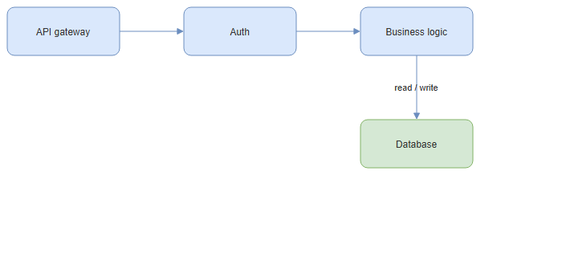

# dsh-drawio

[English](README.md) | 中文

一个 [DeepSeek Harness](https://github.com/deepseek-ai/deepseek-harness)（DSH）插件：在 Web 侧栏中把 `.drawio`
文件预览为图表。在文件树里打开它，渲染出来的是你画的那张图，而不是 mxGraph XML 源码。



需要编辑请用 [`dsh-drawioedit`](https://github.com/zhang-guo-wen/dsh-drawioedit)。两者是互相独立的包；下面的
「已知限制」说明什么时候本插件的预览就够了。

## 这个插件能做什么

- **只读且惰性。** 文件在屏幕外解码与布局；面板拿到的是 SVG `data:` URL，而绝不是引擎实例或活的 DOM，因此图里的
  内容无法对页面执行脚本。
- **兼容 draw.io 的两种保存格式。** 纯 mxGraph XML，以及 draw.io 的压缩体（base64 + raw DEFLATE + 百分号转义）。
  多页 `<mxfile>` 只渲染第一页。
- **内容不出本机，且用 draw.io 的样式。** 渲染完全本地完成，与托管查看器不同。渲染器套用一份与 draw.io 默认值一致的
  样式表，因此样式串里没写颜色的单元格，不会继承底层引擎自己的配色；单元格自身的样式依然优先。

## 安装

构建好的 `lib/` 随仓库提交，所以装完即可运行，**你这边不需要构建**。`dsh plugin` 会同时加依赖条目与 profile 的
bundle 条目——不要手写 profile 清单。

```sh
# 从 HTTPS / SSH 拉取仓库，或装本地 checkout —— 本地目录会被 pnpm 建成软链，
# 重建 lib/ 后下次启动即生效
npx @deepseek-ai/dsh plugin --profile web add git+https://github.com/zhang-guo-wen/dsh-drawio.git
npx @deepseek-ai/dsh plugin --profile web add git+ssh://git@github.com/zhang-guo-wen/dsh-drawio.git
npx @deepseek-ai/dsh plugin --profile web add /绝对路径/dsh-drawio

# 然后重启 host
npx @deepseek-ai/dsh web
```

卸载用 `dsh plugin --profile web remove @guowenzhang/dsh-drawio`，依赖与层一起移除。

所安装的 profile 必须已经组合了 `@deepseek-ai/dsh-client-ui-sidebar-documentpreview`——本插件所贡献的注册表由它
拥有。所有随附的 web profile 都满足这一点。

## 已知限制

**连线绕行与边标签位置与 draw.io 不一致。** `.drawio` 文件存的是边的两个端点与 `edgeStyle` 名称，**不存中间的
路径**：

```xml
<mxCell id="e4" style="edgeStyle=orthogonalEdgeStyle;…" edge="1" source="n4" target="n5">
  <mxGeometry relative="1" as="geometry" />   <!-- 没有路径点，也没有标签偏移 -->
</mxCell>
```

因此两个 viewer 都在渲染时用相同输入、**不同代码**各自计算拐点与标签位置：draw.io 编辑器在共用引擎之上加了自己的
路由与标签避让逻辑，本插件用的引擎不含这段代码。当两个节点间距小于标签宽度时（相距 50px、标签宽 66px），不移动节点
就没有位置能同时避开两个框，而给标签加不透明背景只会盖住底下的文字。

**变通办法。** 在 draw.io 里把边标签拖到你想要的位置：编辑器会把显式的 `<mxPoint as="offset">` 写进文件，此后
**任何 viewer（包括本插件）都会遵循它**。把两个节点的间距拉宽同样有效。两者都是**在图的源头修好**，而不是只在某一个
viewer 里修。

**引擎形状集之外的形状会画成普通矩形**，而不是被略过：draw.io 自带几百个 stencil 形状，而打包进来的引擎只有它自己
较小的一套。

## 开发

**仓库根就是插件包**：根 `package.json` 即 `@guowenzhang/dsh-drawio`。`npm install <git-url>` 与
`dsh plugin add` 打包的都是仓库根，所以放在 `packages/*` 下的插件会被装成错误的东西。

```sh
npm install
npm run build      # host 半用 tsdown；浏览器半用 build-client.mjs
npm run typecheck  # 针对「已发布」的 @deepseek-ai/* 包做 tsc
npm test           # 按浏览器的方式加载构建产物
```

改动 `src/` 后请重新 `npm run build` 并提交 `lib/`。

harness 单仓打客户端产物用的脚本并未发布，因此本仓库自己打包浏览器半。`platform: 'browser'` 是显式设置的：在打包器的
`node` platform 下，若某库的 `exports` 把平台条件排在 `import` 之前，它的**服务端入口**就会被内联，而那些入口可能在
模块作用域调用 `createRequire('module')`，产出浏览器模块表无法应答的 `require("module")`。只有 react 与 DSH 客户端包
保持 external，因此部署产物没有安装期依赖；`npm test` 用一个只含上述 external 的模块表加载产物，产物若索取其他任何
东西即失败。

## 许可

Apache License 2.0 —— 见 [LICENSE](LICENSE)。内联的第三方代码在 [NOTICE](NOTICE) 中署名。
"draw.io" 是其所有者的商标；本包与 draw.io 无隶属或背书关系。
